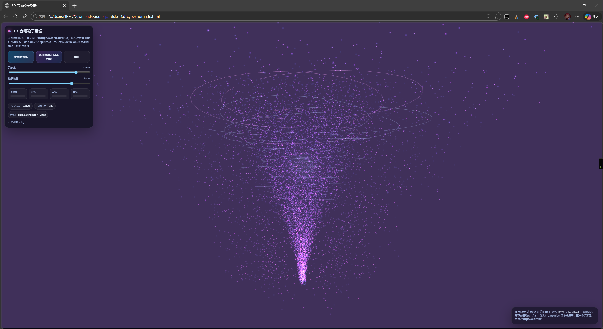

# 3D 音频动效反馈

一个能对 麦克风输入/标签页音频采集 实时反馈为3D粒子动效的 HTML。

## 效果展示

## 功能
- 支持麦克风输入
- 支持标签页 / 屏幕音频采集
- 实时响度与频段反馈
- 基于 Three.js 的 3D 粒子可视化

## 使用方式
直接在浏览器中打开 `audio-particles-3d.html`。

采集音频，建议使用 **HTTPS** 或 **localhost**,给麦克风权限。  
抓取网页声音，建议用 Chromium 内核浏览器，并勾选 **共享标签页音频**。